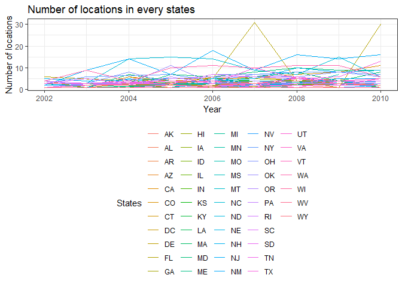
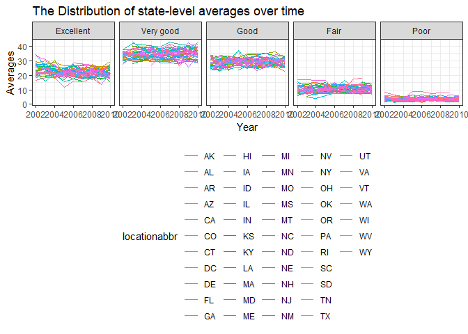
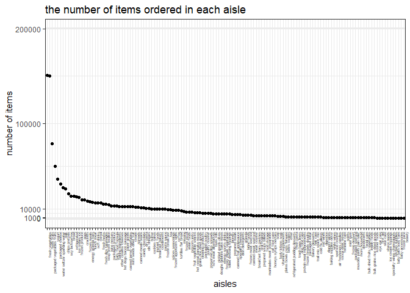

p8105\_hw3\_pc2853
================
pc2853
October 15, 2018

Problem 1
=========

``` r
devtools::install_github("p8105/p8105.datasets")
```

    ## Skipping install of 'p8105.datasets' from a github remote, the SHA1 (21f5ad1c) has not changed since last install.
    ##   Use `force = TRUE` to force installation

``` r
library(p8105.datasets)
data(brfss_smart2010)
```

``` r
brfss_smart2010 =
  brfss_smart2010 %>% 
  janitor::clean_names() %>% 
  filter(topic == "Overall Health") %>% 
  filter(response == c("Excellent", "Very good", "Good", "Fair", "Poor")) %>% 
  janitor::clean_names()  %>% 
  mutate(response = forcats::fct_relevel(response, c("Excellent", "Very good", "Good", "Fair", "Poor")))
```

#### In 2002, which states were observed at 7 locations?

``` r
brfss_smart2010 %>% 
  group_by(locationabbr) %>% 
  summarize(n_locations = n_distinct(locationdesc))
```

    ## # A tibble: 51 x 2
    ##   locationabbr n_locations
    ##   <chr>              <int>
    ## 1 AK                     2
    ## 2 AL                     4
    ## 3 AR                     3
    ## 4 AZ                     5
    ## 5 CA                    12
    ## # ... with 46 more rows

Looking at the summarized result about the number of location in each states, the states that have 7 locations are CT, MT, NH, OR, UT.

#### Make a “spaghetti plot” that shows the number of locations in each state from 2002 to 2010.

``` r
brfss_smart2010 %>% 
  group_by(year, locationabbr) %>% 
  summarize(n_locations = n_distinct(locationdesc)) %>% 
  ggplot(aes(x = year, y = n_locations, color = locationabbr)) + geom_line() +
  labs(
    title = "Number of locations in every states",
    x = "Year",
    y = "Number of locations",
    color = 'States'
    )  
```



I make a spaghetti plot using geom\_line with defferent color within different states, which summarizing the number of locations in each states.

#### Make a table showing, for the years 2002, 2006, and 2010, the mean and standard deviation of the proportion of “Excellent” responses across locations in NY State.

``` r
brfss_smart2010 %>% 
  filter(year == c(2006, 2002, 2010), locationabbr == "NY", response == "Excellent") %>% 
  group_by(year) %>% 
  summarize(NYmean = mean(data_value, na.rm = TRUE), NYsd = sd(data_value, na.rm = TRUE)) %>% 
  knitr::kable(digits = 1)
```

    ## Warning in year == c(2006, 2002, 2010): longer object length is not a
    ## multiple of shorter object length

|  year|  NYmean|  NYsd|
|-----:|-------:|-----:|
|  2002|    19.5|   NaN|
|  2006|    18.9|   NaN|
|  2010|    21.5|   6.1|

I made a table containing the mean and standard deviaion of the proportion of excellent response of NY state in 2002, 2006, 2010 by using the data\_value.

#### For each year and state, compute the average proportion in each response category (taking the average across locations in a state). Make a five-panel plot that shows, for each response category separately, the distribution of these state-level averages over time.

``` r
brfss_smart2010 %>% 
  group_by(locationabbr,year,response) %>% 
  summarize(mean_proportion = mean(data_value)) %>% 
  ggplot(aes(x = year, y = mean_proportion, color = locationabbr)) + facet_grid(~ response) + geom_line() +
  labs(
    title = "The Distribution of state-level averages over time", 
    x = "Year",
    y = "Averages"
  )
```



Problem2
========

``` r
data(instacart)
```

``` r
instacart = 
  instacart %>% 
  janitor::clean_names()
```

The data instacart imported from online is a dataset with dimension 1384617, 15. It recorded every users imformation with various aspects for example the number of orders and the product number, ordered by each order id of individual users. \#\#\#\#How many aisles are there, and which aisles are the most items ordered from?

``` r
instacart %>% 
  group_by(aisle) %>% 
  select(aisle_id, order_id) %>%
  summarize(n_orders = n()) %>% 
  arrange(desc(n_orders)) %>% head(1) 
```

    ## Adding missing grouping variables: `aisle`

    ## # A tibble: 1 x 2
    ##   aisle            n_orders
    ##   <chr>               <int>
    ## 1 fresh vegetables   150609

In total there are 134 aisles, where fresh vegetables are the most items ordered from.

#### Make a plot that shows the number of items ordered in each aisle. Order aisles sensibly, and organize your plot so others can read it.

``` r
instacart %>% 
  group_by(aisle) %>% 
  summarize(n_items = n()) %>% 
  mutate(aisle =  forcats::fct_reorder(aisle, desc(n_items))) %>%
  ggplot(aes(x = aisle, y = n_items)) + geom_point() +
  scale_y_continuous(breaks = c(0, 1000, 10000, 100000, 200000), limits = c(0, 200000), labels = c("0", "1000","10000","100000","200000")) +
  labs(
    title = "the number of items ordered in each aisle", 
       x = "aisles",
       y = "number of items") +
  theme(axis.text.x = element_text(angle = 90, size = rel(0.5), hjust = 1)) 
```



#### Make a table showing the most popular item in each of the aisles “baking ingredients”, “dog food care”, and “packaged vegetables fruits”.

``` r
instacart %>% 
  filter(aisle == c("baking ingredients", "dog food care", "packaged vegetables fruits")) %>% 
  group_by(product_name, aisle) %>% 
  summarize(n_popular = n()) %>% 
  group_by(aisle) %>%
  filter(n_popular == max(n_popular)) %>% 
  knitr::kable()
```

| product\_name                                   | aisle                      |  n\_popular|
|:------------------------------------------------|:---------------------------|-----------:|
| Light Brown Sugar                               | baking ingredients         |         157|
| Organic Baby Spinach                            | packaged vegetables fruits |        3324|
| Organix Grain Free Chicken & Vegetable Dog Food | dog food care              |          14|

THe most popular products are light brown sugar in baking ingredients, the organic baby spinach in packaged vegetables fruits, and the organix grain free chicken&vegetable in dog food care.

#### Make a table showing the mean hour of the day at which Pink Lady Apples and Coffee Ice Cream are ordered on each day of the week; format this table for human readers (i.e. produce a 2 x 7 table).

``` r
instacart %>% 
  filter(product_name == c("Pink Lady Apples", "Coffee Ice Cream")) %>% 
  mutate(order_dow = recode(order_dow, "0" = "sunday", "1" = "monday", "2" = "tuesday", "3" = "wednesday", "4" = "thursday", "5" = "friday", "6" = "saterday")) %>% 
  group_by(product_name, order_dow) %>% 
  summarize(mean_hrs = mean(order_hour_of_day)) %>% 
  spread(key = order_dow , value = mean_hrs) %>% 
  knitr::kable(digits = 1)
```

    ## Warning in product_name == c("Pink Lady Apples", "Coffee Ice Cream"):
    ## longer object length is not a multiple of shorter object length

| product\_name    |  friday|  monday|  saterday|  sunday|  thursday|  tuesday|  wednesday|
|:-----------------|-------:|-------:|---------:|-------:|---------:|--------:|----------:|
| Coffee Ice Cream |    10.3|    15.0|      12.4|    13.2|      15.2|     15.3|       15.4|
| Pink Lady Apples |    13.9|    11.7|      11.6|    12.2|      11.9|     12.0|       13.9|

I created a 2x7 table using spread command to summarized the mean hours of a day of the two products under each day of a week.

Problem3
========

``` r
data("ny_noaa")
```

``` r
ny_noaa = 
  ny_noaa %>% 
  janitor::clean_names() 
```

This data set has a dimension of 2595176, 7and a structure which is . It is a dataset containing information about the weathers in NY which are collected by different weather station identified with id each in the data. The date of recording, the number of occurance of snowing, precipitation, the depth of snowing, and the range of temperature are also included. Within the dataset, there are a significant extent of missing data.

``` r
na_tmin = 
  ny_noaa %>% 
  filter(is.na(tmin)) %>% 
  count()
```

For example, The percentage of missing data in minimum temperature is 0.4371264. which is almost the half of the aquired data, that will definitely decrease the sample size of the statistically significant data.
